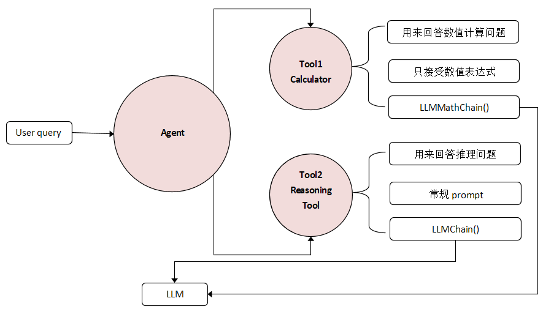

# llm_agent_math
本项目利用chatglm6b实现一个中文版的算术和推理功能，目的是探索llm agent的算术和推理能力。

This project uses chatglm6b to implement a Chinese version of arithmetic and reasoning function, aiming to explore the arithmetic and reasoning ability of llm agent.

## flow
 

## Tools

1. **Calculator**:
   - This tool would be responsible for solving a user’s math queries. This includes anything involving numerical calculations. For example, if a user asks what the square root of 4 is, this tool would be appropriate.
2. **Reasoning Tool**:
   - The second tool in our application setup would be a reasoning tool, responsible for tackling logical/reasoning-based user queries. Any mathematical word problems should also be handled with this tool.

## chatglm server
You need to deploy a chatglm service, see chatglm_server/chatglm_flask_server.py

## test
    print(agent.invoke({'input':'1000的平方根是多少?'}))
    print(agent.invoke({'input':'小明的姐姐比他大10岁。小明出生在新中国刚成立的时候。小明的姐姐是什么时候出生的?'}))
